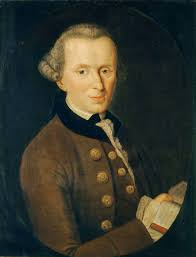
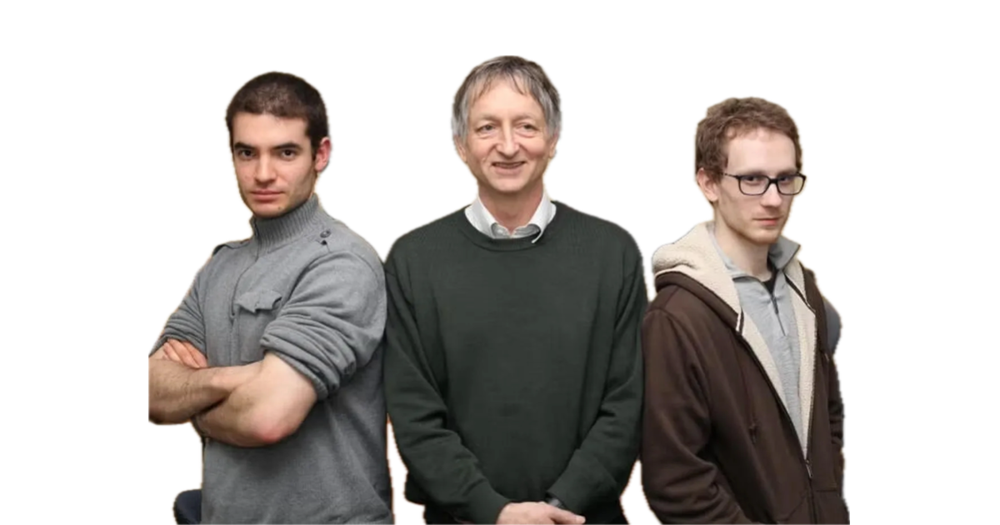
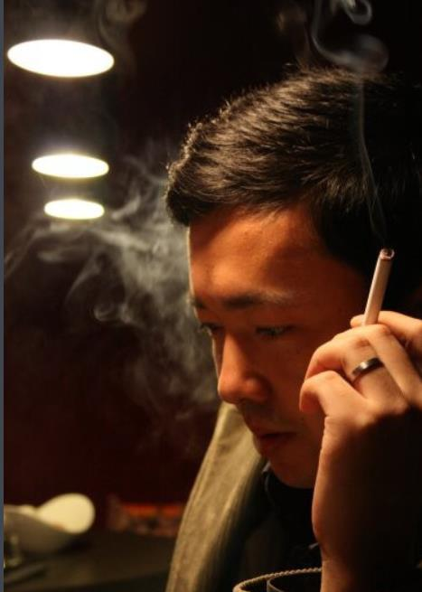
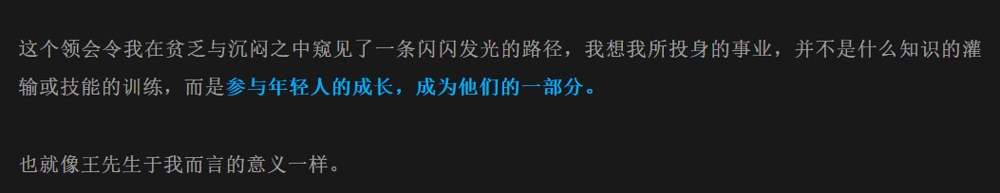
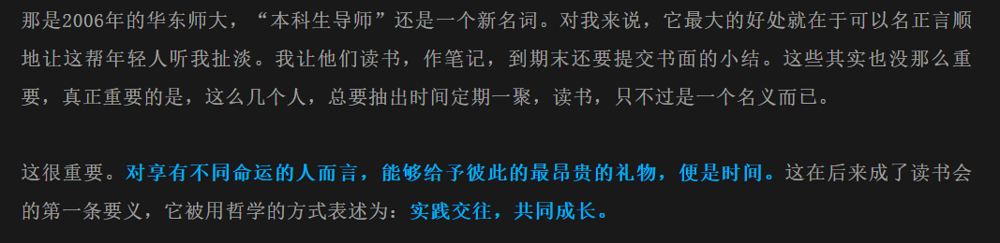
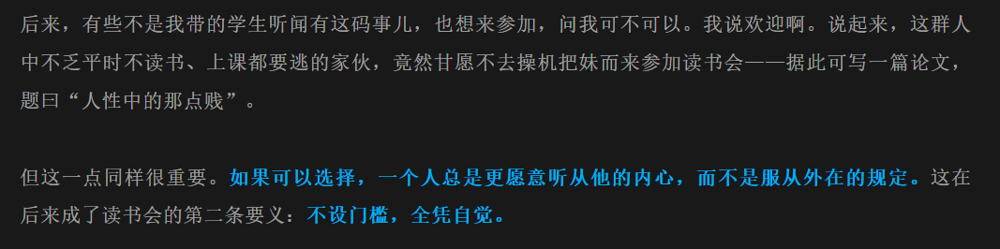
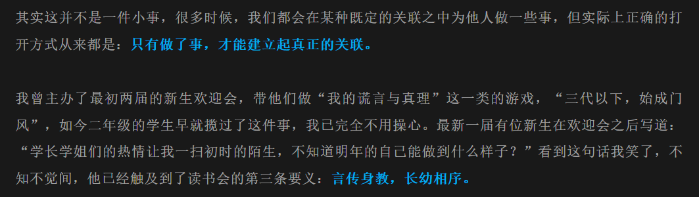
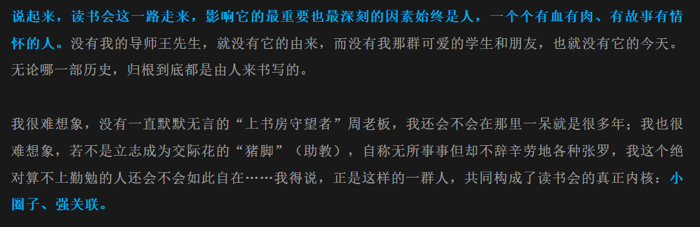

## 伊曼努尔·康德
<!-- 学派 -->
[](#)
[](#)
[](#)
[](#)
[](#)
[](#)
[](#)
[](#)
[](#)
[](#)
[](#)
[](#)
[](#)

<!-- 领域 -->
[](#)
[](#)
[](#)

<!-- 思想 -->
[](#)
[](#)
[](#)
[](#)

<!-- 继承 -->
[](#)
[](#)
[](#)
[](#)
[](#)
[](#)
[](#)
[](#)
[](#)
[](#)
[](#)    
[](#)
[](#)

<!-- 肖像 -->
_1724-04-22..1804-02-12(79yrs)_

### 人不能仅仅是工具，人必须是目的

## Hinton Lab

[](https://scholar.google.com/citations?user=x04W_mMAAAAJ&hl=en&oi=ao)
[](https://scholar.google.com/citations?user=JicYPdAAAAAJ&hl=en&oi=ao)
[](https://scholar.google.com/citations?user=xegzhJcAAAAJ&hl=en&oi=ao)


{: w="400" h="200" }

### attenion-is-all-you-need

### 使用深度卷积神经网络进行ImageNet分类识别

## 蔡剑锋

[](https://mp.weixin.qq.com/s/GiU_evtmAidB1WzrnRNuJA)

{: w="200" h="100" }_其人_

_其言·教育事业_

_其言·读书会·要义一_

_其言·读书会·要义二_

_其言·读书会·要义三_

_其言·读书会·内核_

### 荐读人/开放教学

```md
我觉得、你应该、话语权。
你之外还有一个拥有和你不同经验、思考的他者。
```

### 读书会/影读会

#### 读书会之我见@114-05-29

我和蔡剑锋聊到一件事：“为什么叫读书会，实质上是你的个人演讲？”这个你倒是说对了一件事，他几个小时以来第一次赞同我。

话语权是需要抢夺的，蔡氏说。作为过来人他很好的扮演了角色，但是阿妍阿狗并没有去争取任何内容，也许是因为《破地狱》这部电影蔡氏所选的缘故。尽管多少有些盲人摸象，但我确实每次参与读书会、影读会都几乎是蔡氏个人秀，甚至有一些他称之为“某些刻意挑衅，是企图引发年轻人对话”，但在不了解发言者目的的我看来，单纯是老登在自己的地盘肆意妄为、蹬鼻子上脸了。

不过“需要争夺”我是认同的。尤其在与蔡氏谈不上亲近的情况下，他能这般平等与我对话，就能看出他对于读书会、荐读人的初衷大概是认真的。不过就连读书会的原则都藏的这么深，而他说“我难道要立个牌子把所有事情写在上面”。

但我总觉得这是一种两难。年轻人问出仅仅看上去不切身的问题就要受到压力、指责，例如“学生思维”帽子、“和你没关系就不要问”、“哪有那么多为什么”，这是年轻人的现实；年轻人不问超出切身范围的问题，慷慨能言如老登，都要把界限划在你问了个么我就说了、“你要是没这个能力我选择你干嘛”。换言之，年轻人多问要受到社会压力，不多问也要受到社会压力加上现实压力，于是年轻人问不问都要顶着压力立于社会。这恐怕就是年轻人不得不面对的现实了。

咳咳，似乎得出这个结论过于晚了。另外我从蔡氏、杨氏(ysch_880)身上看到一些黑箱的东西，我很好奇那究竟是什么。蔡氏说上一个像我这样说话的，是十年前一位看很多书，却少与人交往的上海学生；杨氏说，和我聊天总是有一种予取予求的感觉。二者身上都有一种强烈的克制、压抑氛围，但并非刻意的、费力的，而是自然而然的、和谐的克制和压抑。杨氏出身新疆，也许和受到`715事件`洗礼相关，但我到毕业都无法和他建立起联系。

## 卡尔·保罗·波兰尼

{: w="200" h="100" }_1886-10-25..1964-04-23(77yrs)_

> We can know more than we can tell. (Karl Paul Polanyi)

### Personal Knowledge, 1958