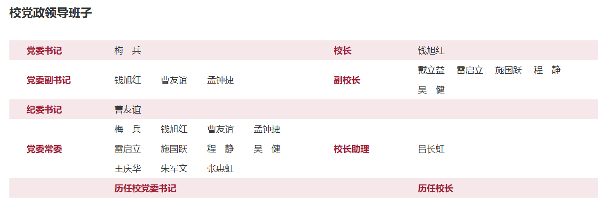
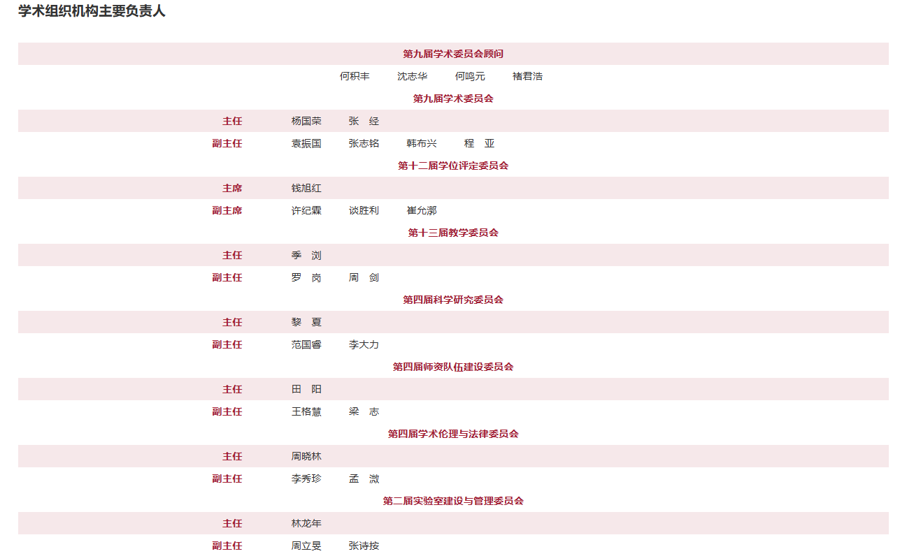

> (・∀・(・∀・(・∀・*) 你知道吗?
> 
> `ctrl` + `。`大法好
> shared knowledge -> common knowledge
{: .prompt-tip}

在这章，我们将讨论国家体制：包括叙事的、宣称的、应然的；以及实然的、实践的、现实的。

我们也许会提到孟德斯鸠的“三权分立”（Separation of Powers），也许不会，但一定会重点关注中国(P.R.C)这个当代国家。

横向地，我们会比较台湾，也就是中华民国（R.O.C）这个兄弟国家(或者你愿意，也可以叫他台湾省，中国的一部分)。以及世界上第一个立宪国家、民主灯塔国：美利坚共和国（U.S.A）。

```yaml
init: 2
add: 2
add: 6
```

## 导语

### 孟德斯鸠

{: w="200" h="100"}_孟德斯鸠（法语：Montesquieu，1689年1月18日—1755年2月10日），原名夏尔·路易·德·塞孔达（法语：Charles Louis de Secondat），法国启蒙时期政治哲学家、历史学家、社会学家、作家与法官_

300年前...

1689年1月18日，孟德斯鸠(1)出生于法国波尔多附近的拉布雷德城堡的贵族家庭。

1716年，孟德斯鸠(27)袭男爵封号，曾任律师、波尔多法院庭长。路易十四晚年朝政混乱、衰败，于是路易十五即位，由母后摄政，法国社会动荡依旧。

1721年，孟德斯鸠(32)记录其见闻，积稿十年整理成《波斯人信札》。

1728年，孟德斯鸠(39)旅访奥、匈、意、德、荷、英等国作学术旅行，实地考察其社会政治制度、民风民俗、人文地理、科学技术，并积累大量日记、笔记，成为日后《论法的精神》的基础资料。

1748年，孟德斯鸠(59)以27年的光阴出版《论法的精神》，全面分析了**三权分立**的原则。伏尔泰夸赞这本篇幅巨大包罗万象的著作是“理性和自由的法典”。

> 什么是“三权分立”？
> 
> “三权分立”（Separation of Powers）由孟德斯鸠提出，指国家权力分为：
> - 立法权（如国会）
> - 行政权（如总统/政府）
> - 司法权（法院）
> 
> 三者互相制衡与独立，防止专制。
{: .prompt-info}

1755年2月10日，孟德斯鸠(66)病逝于巴黎。

### 鸟瞰

{: w="800" h="400"}

{: w="800" h="400"}

{: w="800" h="400"}

```yaml
Dict:
  DE: Direct Election # 直选
  HoS: Head of State # 元首
  CP: Communist Party # CCP

  MI: Military # 武装力量
  LE: Legislative / Legislative Election  # 立法权 / 立法选举
  EX: Executive # 行政权
  JU: Judicial # 司法权
```

#### PRC 🇨🇳（if you buy it）

```yaml
PRC:
- 实质: 1+0 党国体制 党的领导高于一切 架空的人大

- 中国共产党:
    num: CP0
    来源: 党代表大会间接选举、组织任命
    主要: [总书记, 中共中央政治局常委, 中央军委主席]
    定位: 领导一切，制定路线方针政策

- 全国人民代表大会:
    num: LE0
    来源: 地方代表间接选举（无党派竞争）
    主要: [人大代表约3000人, 常委会委员长]
    定位: 制定法律、选举国家机构、监督国务院等

- 国务院:
    num: EX0
    来源: 国家主席提名，总人大批准
    主要: [总理, 副总理, 各部部长]
    定位: 行政管理、政策执行、对人大报告工作

- 最高人民法院:
    num: JU0
    来源: 全国人大任命
    主要: [首席大法官, 审判委员会]
    定位: 审理国家重大案件、解释法律

- 中央军委:
    num: MI0
    来源: 中共中央+全国人大
    主要: [主席（总书记兼任）, 军委委员]
    定位: 统一领导全国武装力量

```

#### ROC 🇹🇼

```yaml
ROC:
  - 实质: 5 针对清政府腐败 孙中山的五权分立

  - 国民大会_F:
      状态: 冻结
      职能: 人民直接行使政权

  - 总统府:
      编码: DE0
      来源: 公民直选、一人一票
      定位: 国家元首、大政方针
      组成:
        - 总统
        - 副总统
  - 立法院:
      编码: DE1
      来源: 公民直选、一人一票；立委互选
      定位: 立法、预算
      组成:
        - 立法委员
        - 院务:
            - "&院长"
            - "&副院长"

  - 行政院:
      编码: HoS0
      来源: 总统直任；略
      定位: 执行政策、施政细节
      组成:
        - 领导:
            - "&院长"
            - "&副院长"
        - 内阁:
            - 内阁各首长
            - 政务委员
  - 司法院:
      编码: HoS1
      来源: 总统提名 → 立法院同意
      定位: 司法、大法官、宪法法庭
      组成:
        - "&院长"
        - "&副院长"
        - "&大法官"
  - 考试院:
      编码: HoS2
      来源: 总统提名 → 立法院同意
      组成:
        - "&院长"
        - "&副院长"
        - 考试委员
  - 检察院:
      编码: HoS3
      来源: 总统提名 → 立法院同意
      组成:
        - "&院长"
        - "&副院长"
        - 监察委员
        - 审计长

```

#### USA 🇺🇸

```yaml
USA:
- 定位: 3 功能上 三权分立（Legislative, Executive, Judicial）

- 联邦议会:
    num: LE0
    来源: 公民直选（参议员、众议员）
    主要:
      - [众议院: 435名代表]
      - [参议院: 100名代表]
    定位: 立法、预算、监督行政、批准条约

- 总统府:
    num: EX0
    来源: 间接直选（选举人团）
    主要: [总统, 副总统, 内阁成员]
    定位: 国家元首、政府首脑、军队总司令、外交主导

- 联邦法院:
    num: JU0
    来源: 总统提名 → 参议院同意
    主要: [联邦最高法院首席大法官, 大法官9人]
    定位: 宪法解释、司法审查、联邦法裁决

```

#### [微言书/梦游尘](https://mp.weixin.qq.com/s/7NYfmDDC_IN6XMPZK5XfIA)

_图解国家机构第二版（附原图）_

_前言_

_中央委员会_

_国家机关_

_国务院SC_

## 中国特色2025

### 鸟瞰

中华人民共和国中央人民政府，通称中国政府。

#### 大事记

```yaml
# 大事记
1949年: 中华人民共和国成立
1950–1953年: 抗美援朝战争
1953–1957年: 第一个五年计划
1956年: 百花齐放，百家争鸣
1957年: 反右运动
1958–1960年: 大跃进
1959年: 庐山会议与彭德怀被打倒
1962年: 七千人大会
1966–1976年: 文化大革命
1971年: 林彪事件
1976年: 毛泽东去世，四人帮被捕
1978–1989年: 改革开放与邓小平时代
1989年-2002年: 江泽民及第三代领导时期
2002年-2012年: 胡锦涛及第四代领导时期
2012年-至今:  习近平及第五代领导时期
```

#### 词汇

```yaml
CCP: Chinese Communist Party # 中国 共产党；中共
PRC: People's Republic of China # 中华 人民 共和国；中国
中央: 
    SC: State Council of (the People's Republic of China) # 中华人民共和国 国务院；国务院
    CPG: (The Central People's Government) of (the People's Republic of China) # 中华人民共和国 中央 人民政府；中央 人民政府(1949.10–1954.9)    
NPC: (The National People's Congress) of (the People's Republic of China) # 全国人民代表大会；全国人大 
CPPCC: "Chinese People's Political Consultative Conference (中国人民政治协商会议)"
NGO: "Non-Governmental Organization (非政府组织)"
CMC: "Central Military Commission (中央军事委员会)"
CCDI: "Central Commission for Discipline Inspection (中央纪律检查委员会)"
PLA: "People's Liberation Army (中国人民解放军)"
NPC: "National People's Congress (全国人民代表大会)"
PBSC: "Politburo Standing Committee (中共中央政治局常务委员会)"

# 制度
Hukou: "Household registration system (户籍制度/户口)"
SAR: "Special Administrative Region (特别行政区)"
```

#### Power Structure

```yaml
                           [Constitution]
                                ↓
                     (Theoretical supreme law)
                                ↓
                  ┌──────────────────────────┐
                  │  The State (PRC)         │
                  └──────────────────────────┘
                                ↓
     ┌────────────────────┬──────────────────────┐
     │    State Organs     │    Political Organs   │
     │  (Legal authority)  │ (Actual ruling power) │
     └────────────────────┴──────────────────────┘
                                ↓
     ┌─────────────────────────────┐
     │  Communist Party of China   │
     │  [CPC / CCP, i.e. "the Central"] │
     └─────────────────────────────┘
                                ↓
     ┌─────────────────────────────┐
     │  Central Committee (~370 ppl) │  ← elected by National Party Congress
     └─────────────────────────────┘
                                ↓
     ┌─────────────────────────────┐
     │     Politburo (≈24 ppl)      │  ← chosen by Central Committee
     └─────────────────────────────┘
                                ↓
     ┌─────────────────────────────┐
     │ Politburo Standing Committee│  ← core 7 leaders
     └────────────┬────────────────┘
                  ↓
       [General Secretary of CPC]
         (Currently: Xi Jinping)
            └─ also Head of State
            └─ also Chairman of the Central Military Commission

                                ↓
        ┌──────────────────────────────────────┐
        │     CPC Central Departments           │
        └──────────────────────────────────────┘
        Includes:
          - Organization Dept (personnel control)
          - Propaganda Dept (media & ideology)
          - Political and Legal Affairs Commission (courts, police)
          - Central Military Commission (party controls army)
          - Central Cyberspace Affairs Commission (internet control)
          - Central Commission for Discipline Inspection (party discipline)
          - United Front Work Dept (religious, ethnic, overseas affairs)
          - General Office (internal operations, document flow)

                                ↓
    These departments **control and guide**:
      → State Council (gov't)
      → Courts, Procuratorate (judiciary)
      → Army (via Party's CMC)
      → Universities, SOEs, Media
      → Internet, ideology, appointments
```

### 双重

我国"二律背反"的典型:

```yaml
1.现实冲突: # 宪法没有明确规定“党领导国家机关”，而是模糊使用“领导核心”“统一领导”等表述
    宪法: 中华人民共和国的一切权力属于人民 \ 国家机构实行民主集中制
    现实: 国家的一切权力属于党领导的人民代表大会系统 \ 所有重大决策都由中央拍板
2.宪法冲突: 
    第一条第一款: 中国共产党领导是中国特色社会主义最本质的特征。
    第五条第四款: 任何组织或者个人都不得有超越宪法和法律的特权。
3.吃饭约束:
    民: 饭都吃不上关心这个干嘛?
    官: 饭都吃上了关心这个干嘛?
4.坏人悖论:
    民: 上面的本意是好的,下面的人执行歪了
    官: 下面的人也没办法,都是上边要求的哎
5.言论自由悖论:
    民: 不满意的可以退籍滚出中国
    官: 一个外国人有什么资格说三道四?
6.下大棋悖论:
    民: 你能想到的国家能想不到吗?
    官: 国家这么大上边也不可能面面俱到
```

#### 国家机关

- 声称与实际的位置

```yaml 
# 声称的位置
[人民主权]
    ↓
[中华人民共和国宪法]
    ↓
[国家机关]（人大、国务院、法院、检察院等）
    ↓
[地方政府、法院]
    ↓
[基层群众组织]

# 实际的位置
[中共中央]（党的领导地位 → 党章、惯例、组织控制）
    ↓
[国家机关]（人大、政府、法院等实际由党控制）
    ↓
[地方各级政府]
    ↓
[群众组织]
```

- 横向比较(小)

```yaml
# 国家机关位置
CCP:
    国家机关:
    - 定义: 宪法设立的权力机关
    - 子类:
        - 立法机关: 全国人大系统
        - 行政机关: 国务院系统
        - 执法机关: 公安局、城管、市场监管等
        - 司法机关: 法院、检察院
        - 监察机关: 国家监察委员会
    政治机关:
    - 定义: 中共党内设立的统筹控制机关
    - 示例:
        - 中央组织部: 控人事
        - 中央政法委: 控司法执法系统
        - 中央宣传部: 控思想媒体教育
    - 权力地位: 非国家机关，但实际高于国家机关
    - 来源: 中国共产党，不通过人民选举产生
```

- 横向比较(大)

```yaml
# 美国声称的位置(类比)
[人民主权]（选举产生政府）
     ↓
[国家宪法]
     ↓
[国家机关]（立法、行政、司法）
     ↓
[地方政府/机关]
```

#### 党政不分

```yaml
西方民主国家：
    政党（临时执政） → 指导 → 政府（依法施政） ← 宪法约束 ← 国会/法院

中国体制：
    中国共产党（长期执政） → 实质控制 → 国家政府（国务院等）
                                  ↓
                              政策、干部、人事、资源
```

### Ста́лин

> **_现在可以公开的情报_**
> 
> Генеральный секретарь КПСС
> 
> 书记 = секретарь = 一把手 = 实际负责人
>
> 总书记 = 中共中央总书记/党魁+元首/国家主席+三军统帅/中央军委主席
{: .prompt-tip}

_你以为的书记(secretary)_

{: w="200" h="100"}_共产党的书记(секретарь)_

#### 列宁任命1922

```yaml
General_Secretary_Evolution:
  - origin:
      created_by: "列宁"
      created_year: 1922
      purpose: "党务技术职位，管理组织与文件"
      note: "列宁本人不是总书记"

  - Stalin_takeover:
      took_office: 1922
      key_power_sources:
        - "掌控党务组织与任命"
        - "操控宣传与思想"
        - "控制安全机构与清洗"
      effect:
        - "总书记职位实权化"
        - "从党内协调者变为独裁核心"
        - "建立个人崇拜与肃反体制"

  - Legacy:
      model_spread_to:
        - "中国（中共总书记）"
        - "朝鲜（劳动党总书记）"
        - "越南（越共总书记）"
        - "古巴（古共中央总书记）"
      conclusion: "总书记=党国一体中的至高权位"
```

#### 朕即国家1938

```yaml
Stalin_Power_Seizure:
  - 1922:
      event: "任命为总书记"
      strategy: "通过书记处与组织局控制党内人事"

  - 1924:
      event: "列宁去世"
      action: "封锁列宁遗嘱，对反对意见淡化处理"

  - 1924-1929:
      method: "结盟与分化"
      phases:
        - "与季诺维也夫、加米涅夫结盟打击托洛茨基"
        - "再联合布哈林排挤季诺维也夫和加米涅夫"
        - "最后反手清除布哈林等右派"

  - 1936-1938:
      event: "发动大清洗"
      effect: "肃清所有政治对手，确立个人独裁"

  - result: "将总书记职位实质化为党国最高权力核心"
```

| 书记职务                   | 实际角色/地位                                      |
| -------------------------- | -------------------------------------------------- |
| 中共中央**总书记**         | 中国最高领导人（习近平）                           |
| 省委书记（如上海市委书记） | 一个省的**最高领导人**，地位高于省长               |
| 市委书记（如北京市委书记） | 一个市的最高领导人，地位高于市长                   |
| 党支部书记、校党委书记     | 企业/学校/机关的实际负责人，地位高于“院长”“校长”等 |
| 政法委书记、组织部书记等   | 各系统内部的主官                                   |
|                            |

#### 书记>市长 2025

_陈吉宁·市委书记_

_龚正·市委副书记_

| 项目     | 省长                                     | 省委书记                                       |
| -------- | ---------------------------------------- | ---------------------------------------------- |
| 任命系统 | 由**国务院提名**，全国人大或其常委会批准 | 由**中共中央组织部安排，政治局拍板**           |
| 分管领域 | 行政、经济、财政、医疗、教育等           | 全面领导全省，包括人事、组织、政法、舆论、军队 |
| 实际权力 | 执行党路线的“省级总经理”                 | 决定方向与人事的“省委党魁”                     |
| 地位对比 | 一省“二把手”                             | 一省“第一把手”                                 |


#### 党政军级别

> **_现在可以公开的情报_**
> 
> “党政军”体系，师出于 苏联列宁主义的“民主集中制”政体模式，由中共在延安时期（1935–1945）系统引入并本土化。
> 
> 它源于苏联共产党对国家的“并行支配模式”，强调党领导一切，政是工具，军是武装保障。
>
> 如今它构成了中国权力运行的全部骨架：党管干部、党管媒体、党管政法、党管军队。
{: .prompt-tip}

- 口诀

```yaml
总书记是正国级，副总理副国级。
省长部长正部级，副省副部长副部级。
市长厅长正厅级，县长处长正处级。
基层科员起步走，一步一阶不回头。
```

- 级别表

| 等级           | 官方名称          | 常见职务举例                                                                        |
| -------------- | ----------------- | ----------------------------------------------------------------------------------- |
| 一级（正国级） | 正国家级          | 中共中央总书记（习近平）、国家主席、国务院总理、全国人大委员长、全国政协主席        |
| 二级（副国级） | 副国家级          | 国务院副总理、国务委员、全国人大副委员长、政协副主席、中纪委副书记、各系统书记/部长 |
| 三级（正部级） | 正省部级          | 各省省委书记、省长、中央部委部长（如教育部长）、中央军委下属总部主官                |
| 四级（副部级） | 副省部级          | 副省长、副部长、副军区司令、省会市委书记、中央直属机构副职                          |
| 五级（正厅级） | 正地厅级          | 地级市市委书记、市长、省厅厅长（如省教育厅厅长）、中央司局正职                      |
| 六级（副厅级） | 副地厅级          | 地级市副市长、副局长、中央司局副职、省属重点高校书记/校长                           |
| 七级（正处级） | 正县处级          | 县委书记、县长、厅/局下属处长、大学院系主任、高校处长                               |
| 八级（副处级） | 副县处级          | 副县长、副局长助理、副处长、大学副院长、机关调研员等                                |
| 九级（正科级） | 正乡科级          | 乡镇党委书记、科长、基层派出所所长、初中校长                                        |
| 十级（副科级） | 副乡科级          | 副科长、一般乡镇副职、科室副职、办事员助理                                          |
| 十一级以下     | 科员级 → 办事员级 | 一般公务员：一级科员、二级科员、三级主任科员……                                      |


### 中央

“中国共产党中央委员会”是“中央”的正式全称之一。所谓“中央”, 一般是“中共中央”的简称，通常指代一个比“中央委员会”更精简、更高效、更有实际权力的统治核心系统。

#### 用法

也就是说，“中央”这个词，在不同语境下可能指代：

| 用法                 | 实际所指                                                                           |
| -------------------- | ---------------------------------------------------------------------------------- |
| 法定术语             | 中国共产党中央委员会（即“中央委员”+“候补委员”的合体）                              |
| 日常政令中说的“中央” | 通常指的是政治局、政治局常委、总书记的集合（实权层）                               |
| 某些口语语境         | 更泛化地指中共中央各领导机关（组织部、宣传部、军委、网信办等），即“党中央”整体架构 |

#### 指涉

```yaml
中共全国代表大会（比如二十大）
        ↓ 选出
中共中央委员会\名义最高（200+人）
        ↓ 选出
中共中央政治局\常设执政（24人）
        ↓ 再选出
中共中央政治局常委\执政核心（7人）
        ↓ 提名确认
中共中央总书记\党魁（1人）
```

#### XIX 中央领导机构


#### XIX 中央委员会


### 开会

又到了领导开会的季节.

```yaml
开会:
    T1: 常委会 # 最强 Big7
    T2: 中央政治局会议 # 入局 25人机关委员会
    T3: 党代会/n大 # 决定核心 党内/实质权力最高
    T4: n中全会 # 年度决策 五年规划
    T5: 全国两会 # NPC+CPPCC 法定最高+统战象征
```

#### T1 常委会(7)

```yaml
中央政治局 常务委员会 会议:
  zh_name: "中国共产党中央政治局常委会议"
  en_name: "Politburo Standing Committee Meeting"
  frequency: "高频，可能每周举行"
  level: "党政最高决策机制"
  members: "7名常委"
  functions:
    - "决定国家重大方向"
    - "处理党和政府日常事务"
    - "应对突发事件和安全议题"
  note: "实际国家最高权力中枢，常不公开，具有‘密室政治’特征"

BigSeven:
  - name: "习近平"
    role: "中共中央总书记、国家主席、中央军委主席"
    rank: 1
    power: "全面领导，党政军一体核心"

  - name: "李强"
    role: "国务院总理"
    rank: 2
    power: "政府系统总负责人，经济政策核心执行者"

  - name: "赵乐际"
    role: "全国人大常委会委员长"
    rank: 3
    power: "形式上的最高国家权力机构领导人"

  - name: "王沪宁"
    role: "全国政协主席"
    rank: 4
    power: "统一战线和意识形态总策划者"

  - name: "蔡奇"
    role: "中央书记处书记、中央办公厅主任"
    rank: 5
    power: "中枢调度与执行总书记意志的枢纽人物"

  - name: "丁薛祥"
    role: "国务院常务副总理"
    rank: 6
    power: "协调经济事务、国务院实际运作指挥者"

  - name: "李希"
    role: "中央纪委书记"
    rank: 7
    power: "反腐斗争总负责人，掌握党内监察与问责权力"
```

#### T2 中央政治局会议(25)

```yaml
中共中央政治局:
    来源: 中共中央全体会议 
    组成:
        - 常务委员会 ⊂ 中共中央政治局: 领导+内阁
        - 常务委员会: 7人 
        - 中共中央政治局: 25人

# 政治局会议 常委会会议 政治局会 常委会 PBSC/Politburo Meeting
中央政治局 会议:
  zh_name: "中国共产党中央政治局会议"
  en_name: "Politburo Meeting"
  frequency: "不定期（约每月1次）"
  level: "高层政治会议"
  members: "约25名政治局委员"
  functions:
    - "审议党中央重大方针政策"
    - "酝酿人事安排"
    - "向党代会/中全会报告"
  note: "虽然是高层会议，但多数议题由常委会预先决定，具有仪式化趋势"
```

#### T3 党代会/n大(450~2200)

```yaml
# 党内高层 = 常委 | 政治局 | 中央组织部/书记干部 | 元/长老 
中共党代会代表总数 ≈ 2296人
├── 党内高层（中委、纪委、军委等） ≈ 400~500人
├── 地方和省级党委系统 ≈ 600~800人
├── 企业系统 ≈ 200~300人
├── 教育/文化/科研 ≈ 100~200人
├── 基层工农模范 ≈ 100人
├── 少数民族/妇联代表 ≈ 100人
└── 军队系统 ≈ 300人

中国共产党 全国代表 大会: 
    en_name: "CCP National Congress"
    frequency: "每5年"
    level: "政党最高权力会议"
    functions: 
        - "选举中央委员会"
        - "修改党章"
        - "审议政治路线"
    note: "1921年至今共召开20次"
```

#### T4 n中全会(370)

```yaml
# 中央全会 全会 n中全会 CCP Plenum
中国共产党 中央委员会 全体会议:
    en_name: "Plenum of CCP Central Committee"
    frequency: "一般每年1次"
    level: "党中央的重要决策机制"
    functions:
        - "审议中央委员会工作报告"
        - "决定重大政策"
        - "人事调整"
    note: "若非特殊情况，与党代会间隔召开，规模小于党代会"
```

#### T5 全国两会(5000)

```yaml
# 两会 全国两会
全国两会: 
    en_name: "Two Sessions (NPC + CPPCC)"
        level: "年度政治议程高光时刻"
    functions:
        - "审议政府工作报告"
        - "通过预算及政策报告"
        - "安排年度经济目标"
    note: "是对外政治窗口，经常被官方媒体重点报道"  

# 人大 全国人大 NPC
全国人民 代表大会:
    en_name: "National People's Congress"
    frequency: "每年一次，常务委员会全年运作"
    level: "国家最高权力机关"
    functions:
        - "立法"
        - "选举/任免国家领导人"
        - "批准预算和重大法规"
    note: "代表近3000人，闭会由人大常委会行使职权"  
# 政协 全国政协
中国人民 政治协商会议 全国委员会: 
    en_name: "CPPCC National Committee"
        frequency: "每年一次，与NPC同期举行"
    level: "统一战线咨询机构"
    functions:
        - "政治协商"
        - "民主监督"
        - "参政议政"
    note: "无立法权，属于“谋政策咨询”性质"  
```

### 政治机关

#### 政

中国的`政`与古希腊的`πολις`:

```yaml
政: 
    含义: 君主和大臣们维护统治、治理国家的活动
    主体: ["君主","大臣们"]
πολις:
    含义: 年满20岁的公民（不包括妇女、奴隶和外邦人）都参与城邦的管理和统治工作。在古希腊人看来，人是具有德性的，人生活的意义在于实践自己的德行。
    主体: 年满20岁的公民
    发展: ["politique","Politik","politics"]
```

#### 机关

机关是中国特有的描述方式, 立足党的领导高于一切, 因此用`机关`一词作统筹描述 是更方便的.

```yaml
# 政治机关位置
CCP:
    政治机关:
    - 定义: 中共党内设立的统筹控制机关
    - 示例:
        - 中央组织部: 控人事
        - 中央政法委: 控司法执法系统
        - 中央宣传部: 控思想媒体教育
    - 权力地位: 非国家机关，但实际高于国家机关
    - 来源: 中国共产党，不通过人民选举产生
    国家机关:
    - 定义: 宪法设立的权力机关
    - 子类:
        - 立法机关: 全国人大系统
        - 行政机关: 国务院系统
        - 执法机关: 公安局、城管、市场监管等
        - 司法机关: 法院、检察院
        - 监察机关: 国家监察委员会
```

#### 中央直属

隐性宪外实权基本原理通称: `政治机关核心`及其`内嵌式统治结构`基本原理.

```yaml
# 政治机关
         【中共中央】
              ↓
      ┌────政治机关────┐
      ↓       ↓        ↓
 [组织部] [政法委] [宣传部] ...（隐性实权机关群）
      ↓       ↓        ↓
     人事   法治/维稳   舆论
      ↓       ↓        ↓
 ┌───────────────────────────────────┐
 │             国家机关              │
 │   （人大、国务院、法院、检察院）    │
 └───────────────────────────────────┘
```

**隐性宪外实权**是政治机关的**权力核心真子集**.

```yaml
隐性实权机关:
  - name: "中央组织部"
    type: "人事控制"
    role: "干部任免、考核、升迁"
    controls: ["国务院", "法院", "大学", "军队", "国企", "人大系统"]

  - name: "中央政法委"
    type: "司法/安全控制"
    role: "领导公安、法院、检察院，决定司法走向与维稳策略"
    controls: ["公安部", "法院", "检察院", "司法部", "维稳系统"]

  - name: "中央宣传部"
    type: "意识形态控制"
    role: "媒体导向、文化教育、教材审查，控制话语权与思想方向"
    controls: ["央视", "人民日报", "新闻出版署", "教材体系", "高校思想政治课"]

  - name: "中央国家安全委员会"
    type: "国家安全统筹"
    role: "统筹情报、反间谍、国家安全战略"
    controls: ["国家安全部", "公安部", "外交系统", "军情系统", "网络安全机构"]

  - name: "全面依法治国委员会"
    type: "法治设计与工具化"
    role: "推动法律政治化与审判导向，制定党主导的法治路线"
    controls: ["全国人大法工委", "最高法", "政法系统", "人大体系"]

  - name: "中央网信办"
    type: "网络空间控制"
    role: "网络舆情监管、数据主权维护、平台整治"
    controls: ["互联网平台", "新闻门户", "社交媒体", "数据公司", "网络基础设施"]

  - name: "中央纪委"
    type: "党纪执法"
    role: "党内纪律、反腐巡视，高于国家法律系统"
    controls: ["党政机关", "国企系统", "国家监委", "巡视组", "纪检系统"]

  - name: "中央统战部"
    type: "党外关系与渗透"
    role: "统一战线运作，联系港澳台、宗教、民族与海外华人"
    controls: ["港澳台事务", "宗教团体", "民族事务", "民主党派", "工商联", "侨联"]

  - name: "中央军委（党军委）"
    type: "军事指挥"
    role: "军队最高指挥机关，直属党中央，非国家机关"
    controls: ["全军", "武警", "国防部", "军委机关", "军校"]

  - name: "中央办公厅、政策研究室"
    type: "中枢执行与战略智囊"
    role: "为总书记统筹全局、起草政令、战略设计与传达"
    controls: ["党中央文件系统", "会议筹备", "政策起草", "指令传达"]
```

## 社会现实

从设计和实体上，非常轻描淡写地扫过中国特色实体之后，带着领域知识我们将焦点放在一些常见的语词上。

同样的，我们还是从两个两个角度去审视：他所宣称的，他实际表现的（What he claims, what he actually demonstrates.）。

### 司法公正

> 中：司法机构依法独立审判，维护正义的过程，但前提是“党的领导”。 
> 
> 英：Judicial fairness (under Party leadership)
{: .prompt-info}

```yaml
（1）法院受政法委领导 ≠ 宪法意义下的独立机关；
（2）政法委要“以政治稳定为纲”，对敏感案件统筹处理；
（3）法官人事权由党掌握，审判自由极受限制；
（4）实际案例中政治干预常见、文件讲话频繁强调党性优先；

⇒ ∴ 司法服从于“党的方针与稳定目标”，不是独立于之的法律程序。


典型案例: # 有代表性、公开可查的中国“敏感案件”司法干预
  - 涵盖政法委介入
  - 党性优先
  - 法官人事操控
  - 审判操控
  - 中国司法服从于党的稳定方针 not 法律独立裁量
```

#### 铁链女案 2023

```yaml
案情: 江苏丰县“铁链女”遭拐卖事件引发全国关注，最终主犯被判死刑。
特点:
- 地方压信息/夹内容: 初期地方政府和媒体对事件刻意隐瞒，“拐卖变精神病”；
- 中央政法委组织定调: 舆情爆炸后，中央政法委出面压制讨论，组织“定调”
- 政治风向: 最终法院判决参考政治风向，而非直接法律证据链（如拐卖历史模糊）。
关键词: 地方掩盖 → 舆情反扑 → 政法委定调 → 法院纠偏维稳
```

#### 孙大午案 2021

```yaml
案情: 河北民企家孙大午长期批评地方政府，办民间学校、医疗等；后以“寻衅滋事”“非法集资”等多罪重判18年。
特点:
- 企业接管: 被捕前曾公开反对“国进民退”，案发后政府接管其企业；
- 重大敏感案: 案件被定为“重大敏感案”，由省委政法委成立专案组；
- 舆论全面封锁: 律师被限制接触，被告家属受打压，舆论全面封锁。
关键词: 稳定优先、政治清洗 → 法院配合打压异见企业家
```

#### 709大抓捕案 2015

```yaml
案情: 数百名人权律师、维权人士（如王宇、李和平、周世锋）在全国范围被警方拘捕、软禁、强迫认罪。
特点:
  - 未审先判: 央视提前播出“忏悔视频”
  - 官方通稿强调: “依法打击敌对势力”
  - 提前定性、由上级指导: 多名法官事后承认判决“提前定性、由上级指导”
关键词: 定性为“颜色革命苗头” → 政法委统一布置 → 法院配合处理
```

#### 云大反腐案 2013

```yaml
案情: 云大教授贺卫方举报校内腐败，结果学校党委与地方政法系统联动，将他边缘化并起诉其支持者。
特点:
- 不予审理: 举报内容被法院排除在审理范围之外；
- 接管处理: 多起“相关案件”统一定性、统一口径处理；
- 政法委介入: 云南省委政法委传出“必须封口”的内部讲话。
关键词: 政法委控场、党内压制知识分子、法院形式化
```

#### 谭作人案 2009

```yaml
案情: 谭作人调查四川地震“豆腐渣校舍”，遭当局以“煽动颠覆国家政权”罪判刑5年。
特点:
- 审判完全闭门: 审判完全闭门，拒绝公开；
- 媒体封锁: 媒体不许报道，法庭陈述被屏蔽；
- 维稳: 判决前四川省委开会“维稳部署”
关键词: 揭露真相 → 党定罪名 → 法院配合“压信息”
```

### 定调-执法

> 谁在压制舆论？
> 
> | 机构               | 职能                                                 | 权限                                                                      |
> | ------------------ | ---------------------------------------------------- | ------------------------------------------------------------------------- |
> | **中共中央宣传部** | 全党意识形态总管，统管媒体、出版、教育               | 掌控**主旋律导向**、封杀话题、指导媒体统一发稿                            |
> | **中央网信办**     | 网络舆论管理总枢纽，实为“网络警察+平台管理者+审查者” | 可**直接干预微博、知乎、B站、微信等平台内容与热榜排序**，执行“清朗行动”等 |
{: .prompt-info}

#### 直属中央

```yaml
# 涉及:意识形态、出版与内容审查
中央直属: 
  中宣部: # 统管全国出版、影视、文化、教育、意识形态所有内容
    - 国家电影局: 审查所有国产、进口电影剧本与成片，决定是否公映、是否剪辑、是否禁播
    - 国家新闻出版署: 审查所有图书、报纸、期刊、音像出版物，决定是否出版、是否禁书
    - 扫黄打非办: “扫黄打非”（扫除黄色、打击非法出版物）专责办公室，配合公安、网信办行动
    - 文化和旅游部（辅助）: 管理演出、剧院、演艺活动审批，常参与线下文化审查
  中央网信办: 审查互联网上的内容, 如色情、低俗、暴力、翻墙工具、敏感言论（和平台共管）
国务院: # PRC政府,中央人民政府,政府; 对标ROC行政院, USA联邦政府行政部门
  - 国家广播电视总局: 审批电视剧、综艺、纪录片、网络剧、短视频平台内容，监管导向、封杀艺人

典型: 
  电影审查: 一部电影要公映，必须通过国家电影局“龙标”审查（否则不能上映）；
  出版审查: 一本书要出版，需国家新闻出版署批准（如《1984》被列为“非法出版物”）；
  敏感审查: 微博发布“擦边”“暗示”内容，网信办可要求平台封号/删帖；
  封杀艺人: 某些艺人“政治立场不当”或“私生活问题”会被广电总局“全面封杀”（如赵薇、李云迪）；
  封杀黄色: 黄色网站、小说会被“扫黄打非办”联合网信办/公安查封打击。
```

#### 压制典型(中宣部+网信办)

```yaml
              舆情事件爆发（如铁链女、新疆火灾、白纸运动）
                                ↓
              舆情监测（中央网信办 + 公安网安）
                                ↓
       【定调】由中宣部下发宣传通知/“一号文”/红头文件：
       → 不准报导 / 正面引导 / 使用新华社通稿
                                ↓
       【指令】由网信办对接平台（微博、知乎、B站等）：
       → 删除帖子、屏蔽词条、下架视频、限流账号
                                ↓
         平台技术执行 + 内容审查员介入（人工+算法）
                                ↓
       发帖用户接到警告、限流、封号、或公安上门“喝茶”
                                ↓
                舆论空间沉寂，事件被“降温”
```

| 原始内容       | 发布方式                                 | 官方反应                               |
| -------------- | ---------------------------------------- | -------------------------------------- |
| “铁链女”事件   | 发图加表情，或用“某县某女”代指           | 大量删帖+禁言账号+限流                 |
| “白纸运动”     | 只发一张白纸，或说“今天很白”             | 删图+关键词屏蔽+禁止评论               |
| “709律师案”    | 写“709”、“维权”、“某某律师”              | 关键词屏蔽+整账号封杀                  |
| “新疆火灾封控” | 视频发布后火速下架，被限流               | 视频限播放+发帖账号禁言                |
| “铁拳”政治暗语 | 网民用“铁拳警告”“吃瓜铁拳”等代指政治暴力 | 后续连“铁拳”表情也被限评论、限热度处理 |

#### 方法论

| 手段名称           | 操作方式                                                           | 效果                         |
| ------------------ | ------------------------------------------------------------------ | ---------------------------- |
| 🔍 **限流**         | 不删除内容，但让微博不被推荐、转发数封顶                           | “你说了，没人听见”           |
| 📉 **降热度**       | 手动修改热搜排序，把本应排名前列的话题往后或直接撤下               | 阻止事件扩散                 |
| ❌ **删帖**         | 系统/人工删除敏感帖，账号可能收到“违反社区规范”的提示              | 信息直接消失                 |
| ⚠️ **加警告标签**   | 帖子下方提示“未经证实”“谣言已辟”或“内容存争议”                     | 打击用户信任度               |
| 🚫 **封号/禁言**    | 对频繁发布敏感内容的用户采取“30天禁言”或永久封号处理               | 清除舆论源头                 |
| 👀 **内容推荐屏蔽** | 微博视频、图片不被推荐流中展示，限制点赞和评论                     | 阻断传播路径                 |
| 📵 **影子封禁**     | 用户看似正常发言，实际别人根本看不到（又叫 shadow ban）            | 用户自以为表达，实则被“消音” |
| 🔧 **关键词过滤**   | 敏感词（如“铁链女”“64”“暴力执法”等）直接屏蔽或自动替换成星号或空白 | 无法搜索，无法转发           |

### 自由

> 言论、出版、结社、游行、示威自由（法律规定保障但实践受限）
> 
> 中：宪法赋予基本自由，但附带“不得损害国家安全、公共秩序、社会主义制度”等限制条款。
> 
> 英：Freedoms of speech, press, association, assembly, demonstration — legally guaranteed but practically constrained
> 
> 说明：敏感表达常被视为“非法言论”、“煽动颠覆”、“寻衅滋事”，相关自由缺乏法律保护下的独立司法保障。
>
> | 项目 | 法律文本   | 实际执行           | 特征               |
> | ---- | ---------- | ------------------ | ------------------ |
> | 言论 | 宪法保障   | 高压审查、刑责威慑 | 红线模糊、动态扩张 |
> | 出版 | 形式开放   | 严格审查、自我规避 | 意识形态主导       |
> | 结社 | 可依法登记 | 非国控组织极难存活 | 民间空间窄         |
> | 游行 | 须审批     | 几无批准、压制迅速 | 维稳机制常态化     |
{: .prompt-info}

```yaml
言论自由:
  - 记者张展因疫情期间在武汉发布调查视频被以“寻衅滋事”罪判刑；
  - 彭载舟因微信群中言论被判“煽动颠覆”。
出版自由:
  - 独立媒体几乎不存在，传统媒体由党委书记主持“总编”工作。
结社自由:
  - 民间维权组织、公民社会组织常因“非法集会”或“接受境外资金”等理由被取缔；
  - 工会不独立，全国总工会为中共领导的机构，非底层工人自组织。
游行 示威自由: 
  - 2022年“白纸运动”：多地悼念乌鲁木齐火灾的群众举白纸抗议，遭迅速镇压；
  - 罢工、维权示威频繁被以“扰乱公共秩序”处理。
```

## 党建化

> 中：“党建”指“党的建设”，党建化即指社会各领域都被党组织嵌入或主导。
> 
> 英：Party-building-driven governance
> 
> 说明：高校、企业、社区、NGO、医院、科技组织等设立党支部，党组织参与决策或拥有实质控制力。党建化意味着“社会单位=党的细胞”。
{: .prompt-info}

### 定义

```yaml
党建化:
  中文定义: "党建"指中国共产党对自身组织的建设；"党建化"即社会各类单位嵌入党组织，由党主导或介入其运行与决策。
  英文表达: "Party-building-driven governance"
  本质特征:
    - 党组织嵌入社会单位
    - 党务并入行政事务
    - 组织决策服从政治安排
```

### 领域·原理

```yaml
应用场域:
  高校:
    - 设立党委或党总支
    - 书记常为校领导之一
    - 党委参与/主导校务、人事、学术方向

  国有企业:
    - 设党委（如中石化、中建、中车等）
    - 党委书记常为董事长/总经理
    - 战略决策需“听党话、跟党走”

  民营企业:
    - 鼓励/要求建立党支部
    - 部分省市“党建进章程”
    - 党委参与工会、员工管理、意识形态建设

  社区与居民组织:
    - 居委会配备党建专员
    - 社区书记与党支部书记合一
    - 管控意识形态、稳定、防疫等事务

  医院与科研机构:
    - 医院党委参与科主任任命
    - 重大科研项目需审查政治导向
    - “双带头人”制度（党员专家+行政骨干）

  NGO / 社会组织:
    - 强制登记为“党管社会组织”
    - 党建评估影响资助与合法性
    - 培训“红色社会工作者”

制度依据:
  - 《中国共产党章程》第五章：基层组织的任务
  - 《民法典》与《公司法》最新修订：国企必须设党组织
  - 各地《非公企业党建指导意见》：推进民企党建覆盖
  
操作机制:
  - “应建尽建、应纳尽纳”：凡有3名以上党员单位都要建支部
  - “三重一大”决策制度：重大事项须经党委讨论通过
  - 双向进入、交叉任职：书记/经理可互任（尤其在国企）

现实目标:
  - 以党组织为治理核心
  - 将意识形态、政治忠诚、组织控制嵌入单位运行
  - 达成党对社会的全面领导

官方语境:
  目标表述: "加强党的全面领导"、"推动基层组织全覆盖"
  理论依据: “党政军民学，东西南北中，党是领导一切的”

学术视角（引申）:
  - Governance through party penetration
  - Institutional fusion of state and party
  - Erosion of functional autonomy in civil sphere
```

### ECNU






## 专项行动

### “清朗行动”@网信办

> 全称：“清朗”系列专项行动 
> 
> 由中央网信办主导，自2020年起常态化执行，目标是“营造清朗网络空间”。
>
> 是一种“网信审查+政治宣传+思想整肃”的综合打击手段，
> 
> 网络版“扫黄打非”+“反对自由表达”+“统一思想导向”
{: .prompt-info}

```yaml
重点打击:
  饭圈: 网络“饭圈”文化（粉丝互撕、人肉、控评）
  水军: “网络水军”操控舆论
  低俗: 涉黄涉暴、恶搞、低俗内容
  防沉迷: 未成年人沉迷直播/游戏/短视频
  负能量: “不良网红”“负能量”账号

执行方式:
  限流\封杀: 限流、封号、下架平台内容
  平台审核\报备: 要求平台设立审核机制、报备机制
  公开通报: 公开通报整改平台（如知乎、微博、快手、抖音等）
```

### “雷霆行动”@公安

> “雷霆”是公安系统常用于命名打击犯罪的专项行动名称之一，时间不固定，多为年度重点部署。
> 
> 多用于展现“公安高压态势”，结合“扫黑除恶”“维稳”部署，
> 
> 更多是一种治安震慑工具，也常用于配合重大节日或敏感时期维稳任务
{: .prompt-info}

```yaml
涉及: 
  安全: 严打枪支、爆炸物、毒品、黑恶势力
  赌诈网: 打击网络赌博、电信诈骗、跨境违法犯罪
  争议: 部分省份针对“访民”“聚众扰序”也冠以“雷霆”之名
```

### “扫黑除恶专项斗争”@中央政法委

> 中央政法委牵头的国家级专项政治运动，强调打击“黑恶势力+保护伞”。
> 
> 有民企老板、基层异议者被“按黑处理”；
> 
> 部分案件人为拔高定性，用于政治打压。
{: .prompt-info}

```yaml
特点:
  运动式: 有强烈“运动式执法”特征；
  清除异己: 除了打黑，也清除异己、压制不听话的地方势力；
  扩大化+选择性: 常有“扩大化”“选择性打击”的倾向。
```

### “扫黄打非”行动@扫黄打非办 公安 网信办

> 自1998年起常态化，目标为打击“淫秽色情与非法出版物”。
> 
> 从打击“黄色”扩展到政治“非法”——如《1984》《动物农场》《习近平和他的情人》列入禁书，成为政治审查平台
{: .prompt-info}

```yaml
重点对象:
  色情: 色情网站、黄色小说
  非法: 非法出版物、政治敏感书籍
  擦边: 网上“擦边内容”、不良直播、未成年人暴露等
```

### “平安中国”建设@公安部、政法委

> 是中共中央政法系统提出的宏观战略目标，不是单一行动，而是一系列“维稳 + 智能治理”的统称。
> 
> 强调社会可控性、安全优先于自由，使用高科技手段将社会“模型化”，引发对数字极权的担忧。
{: .prompt-info}

```yaml
内容:
  雪亮工程: 推广“雪亮工程”（全国天网监控系统）
  网格化、信息化: 强化基层治理网格化、信息化
  维稳: 维稳、预防犯罪、反恐、宗教治理等
  警民融合: 宣传“警民融合、社会和谐”
```

## Q.

### question

```yaml
核心特征:
  党政合一: The Party-State fusion
  一元领导: Unified leadership of CCP
  组织嵌入: Organizational embedding
  意识形态导向: Ideological dominance
  权力封闭运行: Closed-loop power operation

关键词:
  #全国人大: National People's Congress (NPC)
  #国务院: State Council
  政法委: Political and Legal Affairs Commission
  中央军委: Central Military Commission (CMC)
  组织部: Organization Department (CCP)
  统一战线: United Front Work

党政关系:
  党大于法: The Party stands above the law
  法为治具: Law as a tool of governance
  权出一源: All power originates from the Party

```

> Q1: 中国公权力是怎么运作的？
> 
> ```yaml
> CCP领导为核心，形成“党政合一”的实际操作结构。
> 
> 虽然在形式上存在“三权分立”对应的国家机关: 
>     立法机关: 全国 人民代表大会（全国人大）
>     行政机关: 国务院
>     司法机关: 人民法院 + 人民检察院
>     军事机关: 中央军事委员会
>     监察机关: 国家监察委员会
> 
> 但这套体系全部处于中国共产党的统一领导之下，体现在: 
>     - 党组织嵌入所有机构: 设立党组、党委
>     - 党管干部: 重要岗位由组织部统一安排
>     - 重大决策: 通过党内议事机制（如政治局常委会）先行决定，之后再由国家机关形式化通过
> ```

>  Q2: 中国人是怎么行使政治权利的?
> 
> ```yaml
> 选举权与被选举权: 18岁以上中国公民可投票选举 基层 人大代表
> 言论、出版、结社、游行、示威自由: 法律规定保障（但实践中受到限制）
> 
> 但实际中: 
> - 人大代表多为间接选举，基层直接选举作用有限
> - 党对舆论空间、NGO、选举有高度控制
> - 党外人士和无党派人士进入政权体系的通道几乎只在党领导下开展（如政协）
> 
> 简而言之: 政治参与路径基本被“党建化”，i.e. 你只能通过党认可的渠道参与政治生活。
> ```

>  Q3: 中国需要法制或者司法独立吗?
> 
> ```yaml
> 法治观: 党的领导下的依法治国
> 司法独立: 不提“司法独立”，而是“司法公正”与“党对政法工作的绝对领导”
> 
> 这意味着:
> - 法律是治理工具，但服从于党的战略
> - 司法系统隶属于党委政法委领导
> - 法官独立判案受到限制，关键案件要政治考量
> 
> 从西方法律意义而言，中国不具备实质性“司法独立”。
> ```

>  Q4: 中国公安意味着什么?
> 
> ```yaml
> 公安系统属于 政法系统，包括: 公安、法院、检察院、司法行政。
> 
> 公安的特点: 
> - 属于行政机关，但又是党的维稳工具
> - 同时承担社会管理、治安维护、情报搜集、舆情监控等任务
> - 在实践中被视作维护“国家安全”和“社会稳定”的第一道防线
> 
> 公安的职能常常与国家安全、国家统一和党权稳定挂钩，不只是 执法机关，更是 政治机关。
> ```

>  Q5: 如何实现"东西南北中 党的领导高于一切"
> 
> 这句话出自 中共总书记 习近平，完整表述是:
> 党政军民学，东西南北中，党是领导一切的。
> {: .prompt-info}
> 
> ```yaml
> 实现方式包括:
> - 1. 党的组织覆盖：所有国家机关、企业、学校、社会组织设党委
> - 2. 干部任免：党组织掌控所有重要岗位人事
> - 3. 意识形态控制：宣传、教育、文化、互联网由党委直接领导
> - 4. 法律服从党：重大案件法律解释以党领导为准
> - 5. 军队归党领导：军委主席制度，确保军队“听党指挥”
> 
> 这使得“党”和“国家”在操作层面高度重合，党领导体制 ie 国家治理体制。
> ```

>  Q6: 中国居民和中国公民差别？
> 
> ```yaml
> 在中国法律中:
>     中国公民: 具有中华人民共和国国籍者
>     中国居民: 指在中国境内合法居住的人（包括港澳台、外籍人士）
> 
> - “公民”强调国籍与权利义务
> - “居民”是地理与行政管理概念
> 
> 在实际操作中，有些政策面向“居民”（如户籍管理、居住证）、有些面向“公民”（如选举权、服兵役）。
> ```

>  Q7: 所以中国人之于公权力意味着什么？
> 
> ```yaml
> 中国人行使政治权利的方式、权利边界、日常生活的治理机制，都是在党国体制框架下定义的。
> 
> 这意味着:
> - 国家权力的行使高度集中，且由党主导
> - 个人权利的伸展空间取决于与体制的关系（顺应与对抗）
> - 在法律上享有权利，但在政治实践中，这些权利的可操作性有限
> ```

### rsrch

```yaml
Q1:
  title: "中国公权力运作机制 / State Power Operation in China"
  content:
    Reality: |
      中国的公权力体系在现实中由党和政府两套结构交织运作，形成“党国”体制。一方面，中国共产党（CCP）通过各级党组织掌控决策权和人事权，在事实上主导国家机关的运转:contentReference[oaicite:0]{index=0}。国家权力名义上由人民代表大会体系行使，全国人民代表大会（NPC）依据宪法被称为国家最高权力机关:contentReference[oaicite:1]{index=1}；但由于人大代表大多数是中共党员，中共能够控制人大议程和人事，从而实际掌握全部国家权力:contentReference[oaicite:2]{index=2}:contentReference[oaicite:3]{index=3}。中国实行民主集中制，重大决策由中共中央（如政治局及其常务委员会）集中决定，再通过国家机关形式予以执行:contentReference[oaicite:4]{index=4}:contentReference[oaicite:5]{index=5}。在各级政府，中共党委书记通常高于同级政府首长，保证党的指令优先落实:contentReference[oaicite:6]{index=6}。总体而言，公权力运作呈金字塔式的层级结构：最高领导层（党中央）集中权力，向下通过党组织和国家行政体系逐级贯彻，确保中共对立法、行政、司法各领域的实际掌控。
    Legal/Official Narrative: |
      官方叙事中，中国的公权力运作被描述为在共产党领导下实行人民民主专政和人民代表大会制度。宪法规定“一切权力属于人民”，人民通过全国和地方各级人大行使权力:contentReference[oaicite:7]{index=7}。全国人大被宣示为最高国家权力机关:contentReference[oaicite:8]{index=8}，国务院（State Council, 中央人民政府, CPG）等行政、司法机关由人大产生并受其监督:contentReference[oaicite:9]{index=9}。中国共产党作为执政党，被称为中国特色社会主义制度的“最本质特征”和“最高政治领导力量”:contentReference[oaicite:10]{index=10}。党对国家的领导地位写入党章和宪法（2018年修宪将“中国共产党的领导”载入宪法第一条）:contentReference[oaicite:11]{index=11}。官方强调这种领导是制度优势，确保全国在党的统一指挥下高效运转。国家权力运行实行民主集中制原则，即在广泛听取意见基础上集中决策，再由各机构统一执行:contentReference[oaicite:12]{index=12}。官方话语还强调依法治国，要求党和国家机关都在宪法法律范围内活动，但同时强调党对军队和政法机关的绝对领导，保证公权力始终服从于党的路线。
    International View: |
      在国际视角下，中国的政治体制通常被归类为威权体制:contentReference[oaicite:13]{index=13}。与三权分立的民主政体相比，中国不存在独立的权力制衡机制——党对立法、行政、司法各领域均有实际控制权:contentReference[oaicite:14]{index=14}。没有自由竞争的全国选举，也没有独立的反对党；国家最高领导人并非由全民直接选举产生，而是由中共内部决定，这在民主国家中极为少见:contentReference[oaicite:15]{index=15}。观察人士指出，中国的“党国”模式使党和国家几乎不可分离，政府机构实际上执行党的决策:contentReference[oaicite:16]{index=16}。这种公权力高度集中于单一政党的现象在当代世界独树一帜（仅在朝鲜、越南等少数一党国家有某些可比之处）。国际社会对此既有关注也有批评，认为缺乏独立监督会导致权力滥用和公民权利受限:contentReference[oaicite:17]{index=17}:contentReference[oaicite:18]{index=18}。同时也有人从国家稳定和经济发展的角度试图解释这一体制，但总体而言，中国公权力运作模式与西方主流民主模式差异巨大。
    Acronyms:
      CCP: "Chinese Communist Party (中国共产党)"
      NPC: "National People's Congress (全国人民代表大会)"
      CPG: "Central People's Government (中央人民政府，即国务院)"
      SC: "State Council (国务院)"
      PBSC: "Politburo Standing Committee (中共中央政治局常务委员会)"
      PRC: "People's Republic of China (中华人民共和国)"
      CPPCC: "Chinese People's Political Consultative Conference (中国人民政治协商会议)"
Q2:
  title: "中国人政治权利的行使 / Citizens’ Exercise of Political Rights in China"
  content:
    Reality: |
      从现实情况看，中国公民可直接参与的政治活动极为有限。选举方面，只有县乡两级的人大代表由公民直接投票选举，而更高层级的人大代表由下一级人大间接选举产生:contentReference[oaicite:19]{index=19}。即使在基层选举中，候选人名额和资格也受到中共严格审查控制，缺乏真正的竞争:contentReference[oaicite:20]{index=20}。全国范围内不存在自由公正的竞选和投票，执政党垄断政治权力，任何独立的反对力量都被压制:contentReference[oaicite:21]{index=21}。公民的言论和结社等政治表达权利在实践中受到审查与限制，公开批评政府可能招致网络审查或以“颠覆国家政权”等罪名被逮捕:contentReference[oaicite:22]{index=22}。对于普通人，参与政治更多是通过官方渠道，如向政府信访（上访）反映意见、在有限范围内参加听证会或基层协商等。然而这些途径往往难以实质影响决策，很多上访者的问题长期得不到有效解决。人大代表机制形式上提供了利益表达渠道，但人大代表主要由党主导产生，对政府决策难以形成独立约束:contentReference[oaicite:23]{index=23}。总体而言，中国公民个人难以通过选票更换执政者或政策，政治权利的行使空间局限在官方许可的范围内。
    Legal/Official Narrative: |
      官方宣称中国实行的是“全过程人民民主”，公民享有广泛的政治权利:contentReference[oaicite:24]{index=24}。宪法和法律规定年满18周岁的中国公民（未被剥夺政治权利者）都有选举权和被选举权:contentReference[oaicite:25]{index=25}。国家通过普选和间接选举相结合的方式产生各级人民代表大会代表，五级人大代表均由民主选举产生，每届任期五年:contentReference[oaicite:26]{index=26}。政府强调基层民主实践，如村民自治和居民自治：农村村委会和城市社区居委会由居民直接选举产生，以管理本社区公共事务:contentReference[oaicite:27]{index=27}:contentReference[oaicite:28]{index=28}。除选举外，中国还有“协商民主”渠道，人民政治协商会议（CPPCC）等机构汇集共产党和各民主党派、无党派人士，就国家大政方针和社会事务进行政治协商。官方称公民可以通过人大建议、政协提案、网络民意征集等多种途径参与决策:contentReference[oaicite:29]{index=29}。“人民当家作主”被视为根本原则，政府公布《中国的民主》等白皮书宣称中国民主注重实质效果而非西方式竞选承诺:contentReference[oaicite:30]{index=30}:contentReference[oaicite:31]{index=31}。同时，法律强调公民行使权利必须在法律规定范围内进行，不得损害国家利益。总体官方叙事描绘了一幅公民通过选举、参与、监督各环节有序参与政治生活的图景，并将其标榜为有别于西方的中国特色民主。
    International View: |
      国际上普遍质疑中国公民政治权利的实际状况。与拥有普选权和多党竞争的民主国家相比，中国公民无法选择替换国家领导人，只有象征性或非常局部的选举权。观察人士指出，中国所谓的选举缺乏真正竞争，独立候选人受到打压，选民在各级别实际上没有可以选择的不同政治主张:contentReference[oaicite:32]{index=32}。公民表达政治诉求的途径也受到严格控制：言论自由受限、媒体和互联网高度审查，未经批准的示威集会难以存在:contentReference[oaicite:33]{index=33}。国际人权组织因此长期将中国列为政治权利“不自由”的国家（例如自由之家将中国的政治权利和公民自由评级为“Not Free”）:contentReference[oaicite:34]{index=34}。相较而言，在民主国家，公民可以通过竞选、投票、言论和结社来直接影响政府政策甚至改变政府，中国的这种一党垄断政治的格局使公民个人难以发挥类似作用。中国官方提出“全过程人民民主”试图论证其政治正当性，但在西方主流观点看来，这一概念更像是为一党统治辩护的政治话术，无法弥补公民缺乏实质选择权的事实:contentReference[oaicite:35]{index=35}。
    Acronyms:
      NPC: "National People's Congress (全国人民代表大会)"
      CCP: "Chinese Communist Party (中国共产党)"
      CPPCC: "Chinese People's Political Consultative Conference (中国人民政治协商会议)"
      PRC: "People's Republic of China (中华人民共和国)"
Q5:
  title: "“党的领导高于一切”的实现 / How Party Leadership Above All Is Enforced"
  content:
    Reality: |
      在现实中，中共通过一系列组织和制度安排实现对“党政军民学，东西南北中”各方面的全面领导。组织结构上，党在国家各层级设立对应的委员会和书记处，比如中央政治局及其常委会是最高决策中枢，省市县各级也有党委书记掌舵，保证党对行政机关的领导。重要的国家机关领导职务几乎均由中共党员担任，党内职务往往高于行政职务:contentReference[oaicite:36]{index=36}。控制机制方面，中共中央组织部等通过干部任免体系（“干部 nomenklatura”系统）控制全国重要岗位的人事安排，确保关键权力岗位由忠于党的人担任。党中央还通过中央军委直接领导人民解放军，实现党对军队“绝对领导”（解放军被明确定位为党军而非国家军队):contentReference[oaicite:37]{index=37}。习近平执政以来，新设多个中央级别的党领导“小组”或“委员会”，由总书记本人挂帅，取代或凌驾于国务院等国家机关职能之上，对经济、国家安全、改革等重大领域集中决策:contentReference[oaicite:38]{index=38}。此外，中央纪委国家监委代表党对各级党员干部行使纪律监察权，以反腐等名义监督和控制官员:contentReference[oaicite:39]{index=39}。制度上，党组织已深入社会基层和各类单位，国有企业和事业单位必须建立党组织，近年甚至要求民营企业设立党支部参与决策，以贯彻党的意志。通过上述组织渗透、人事控制和制度安排，中共事实上确保了对国家机器和社会运行的全方位主导，实现了“党的领导高于一切”的格局。
    Legal/Official Narrative: |
      在官方与法律层面，“党是领导一切的”被视为中国政治的根本原则。习近平强调：“中国特色社会主义制度的最大优势是中国共产党领导，党是最高政治领导力量”:contentReference[oaicite:40]{index=40}。2017年，中共十九大报告明确提出“党政军民学，东西南北中，党是领导一切的”，并将坚持党的全面领导写入党章:contentReference[oaicite:41]{index=41}。2018年通过的宪法修正案第一条也增加了“中国共产党领导是中国特色社会主义最本质的特征”:contentReference[oaicite:42]{index=42}。这些举措从党规和国法上巩固了党的最高地位。官方阐释中，党的领导地位源于历史和人民的选择，是维护国家统一、社会稳定和实现发展的必要条件。对于曾出现的“党政分开”主张，现今领导层予以否定，强调只能有党政分工而决不能削弱党对政府的领导:contentReference[oaicite:43]{index=43}。组织上，各级人大、政府、政协、法院、检察院都在党组或党委领导下开展工作，每年中央还要求全国人大常委会、国务院等向党中央常委会述职汇报，以强化党的集中统一领导。通过法律和制度文件，如《中共中央关于坚持党的全面领导的意见》等，党对军队、武警、国有企事业单位乃至社会团体的领导均有明确规定和落实。总体而言，官方话语将“党的领导”定位为国家治理的最高原则和红线，认为只有坚持党总揽全局、协调各方，才能实现“东西南北中”各领域协调发展，这是中国政治体制的特色和优势所在。
    International View: |
      从国际角度看，“党领导一切”的体制使中国的权力结构与西方民主国家截然不同。多数民主国家实行三权分立，军队效忠国家而非政党，执政党也受选民和法律制约；而在中国，中共将自身置于所有国家机关之上，形成事实上的一党独裁统治:contentReference[oaicite:44]{index=44}:contentReference[oaicite:45]{index=45}。一些分析人士将中国称为“党国”（party-state），指出中共对国家的控制深入到立法、司法、军队和社会组织各层面，这种全面渗透在当代世界极为少见:contentReference[oaicite:46]{index=46}。类似的列宁式政党体制在北朝鲜、古巴等国也存在，但中国的人口规模和党组织对社会的覆盖之广，使其模式格外引人关注。国际社会担忧，在这种结构下缺乏独立监督和权力制衡，容易导致人权侵害和决策失误。例如，党领导下的法律体系被视为“rule by law”而非“rule of law”（法治），法律更多充当党政策的工具而非约束公权力的高于一切的准则:contentReference[oaicite:47]{index=47}:contentReference[oaicite:48]{index=48}。西方政界和学界普遍批评中共垄断一切权力，认为这背离了现代政治中权力来源于人民授权并受人民监督的原则。不过也有人指出，中国模式在维持政局稳定和推动经济发展上取得一定成效，因而在一些发展中国家引发关注和争议。但总体而言，“党的领导高于一切”凸显了中国政治的高度集中和权威特征，在国际比较中属于例外。
    Acronyms:
      CCP: "Chinese Communist Party (中国共产党)"
      PBSC: "Politburo Standing Committee (中共中央政治局常委会)"
      CMC: "Central Military Commission (中央军事委员会)"
      CCDI: "Central Commission for Discipline Inspection (中央纪律检查委员会)"
      PLA: "People's Liberation Army (中国人民解放军)"
Q6:
  title: "中国居民与中国公民的区别 / Difference Between Chinese Residents and Citizens"
  content:
    Reality: |
      按法律定义，凡具有中华人民共和国国籍者都是中国公民（公民身份）:contentReference[oaicite:49]{index=49}。但在现实语境中，“中国居民”通常指在中国境内定居的公民，即持有本国户籍和居民身份证的人:contentReference[oaicite:50]{index=50}。“居民”概念更多与户籍制度相关：户籍所在地决定一个人在哪享受教育、医疗、社保等公共服务。一名中国公民如果没有当地户籍，在该地就不被视为本地“居民”，难以平等享受当地福利。这在中国造成了公民内部的权利差异——例如农村户籍的公民在城市打工但无法落户，长期被当作“暂住人口”，其子女受教育等权益受限:contentReference[oaicite:51]{index=51}。同时，中国公民如果移居海外，其国籍仍保留，但不再是国内居民；类似地，香港、澳门的中国籍人士法律上是中国公民，但在“一国两制”框架下被称为当地“居民”，享有与内地不同的法律地位和权利。需要注意的是，“居民”一词有时也包含非公民：如取得中国永久居留资格的外国人在统计上可称“常住人口”，但他们不是中国公民，没有选举等政治权利。总体而言，在中国“公民”强调国籍与法律身份，“居民”侧重实际居住和户籍身份。两者的区别主要在于户籍制度下公民权利的地域性：拥有中国国籍是获得公民政治法律权利的前提，但要充分享有诸如社会福利等权益通常还需具备本地居民户籍身份。随着户籍改革推进，这种居民与公民间的实际待遇差异有所缩小，但仍然存在。
    Legal/Official Narrative: |
      在官方法律表述中，“中国公民”与“中国居民”概念虽有侧重不同，但并无身份等级之分。根据《中华人民共和国宪法》，具有中国国籍者即为中国公民，公民在法律面前一律平等，国家保障公民的权利和履行义务:contentReference[oaicite:52]{index=52}。法律并未定义一个独立的“居民”身份等级；“居民”通常作为日常称谓，用于指称居住在国内一定地域的人。例如，中华人民共和国居民身份证法中使用“居民身份证”一词，是指签发给境内公民的法定身份证件:contentReference[oaicite:53]{index=53}。官方强调每个中国公民都享有宪法规定的诸项权利（选举被选举权、言论出版等自由）并履行相应义务，无论其户籍所在地如何。对于因户籍产生的公共服务差异，政府近年来推进户籍制度改革，试图消除城乡居民在教育就业等方面的不平等，提倡“市民待遇”逐步向未落户常住人口覆盖。需要指出，在港澳地区，“居民”一词包含中国籍和非中国籍的永久居民，但他们中的中国籍人士仍被中央政府视为中国公民，其国籍由《国籍法》确认:contentReference[oaicite:54]{index=54}。官方法律话语总体上将“公民”作为国籍与法律主体的概念，而“居民”更多出现在户籍管理和行政事务中，二者指向的人群有重合（境内公民）也有区别，但都属于法律框架下规范的人口概念。
    International View: |
      从国际比较看，“公民”与“居民”的区分在不同国家有不同含义。在大多数国家，公民（citizen）指拥有该国国籍、享有全部政治权利的人，而居民（resident）通常指实际居住在该国或地区的人，包括公民和某些长期居留的非公民。中国在国籍法上原则与国际相似：只有公民才能享有选举等政治权利，外国人在华定居亦不赋予公民身份。然而，中国独特的户籍制度使得公民内部出现了类似其他国家“永久居民”和“非永久居民”之间的待遇差异。有评论将中国的户籍制度类比为一种内部的签证/居留许可制度，限制人口自由迁徙并导致公共资源分配不均:contentReference[oaicite:55]{index=55}:contentReference[oaicite:56]{index=56}。这种情况在国际上并不多见——前苏联曾实行“居住证”制度（propiska）类似，中国的城乡户籍鸿沟则被一些观察者形容为“内部等级公民身份（internal tiered citizenship）”。在民主国家，即使有行政区划管理，本国公民通常可以自由迁居并在新居地平等享受权利，这是中国在逐步努力改善的方面。另一方面，中国拒绝承认双重国籍，这点上与很多国家不同，意味着一旦取得外国国籍就不再被视为中国公民。这体现出中国对公民身份的严格定义。总体而言，在国际视角下，中国公民与居民之别主要涉及户籍管理带来的国内待遇差异，而非国籍法律地位的差异；这种通过内部行政制度影响公民权利行使的现象，是中国在人口管理和公共政策上的特殊产物。
    Acronyms:
      PRC: "People's Republic of China (中华人民共和国)"
      Hukou: "Household registration system (户籍制度/户口)"
      SAR: "Special Administrative Region (特别行政区)"
Q7:
  title: "中国人相对于公权力的地位 / The Individual vs State Power in China"
  content:
    Reality: |
      在中国，个人相对于公权力的空间较为有限。尽管宪法列举了公民的各项基本权利，但这些权利在现实中往往缺乏独立保障机制，难以对抗公权力的侵犯:contentReference[oaicite:57]{index=57}。中国现行体制下，宪法不具有司法审查效力，公民无法直接依据宪法起诉政府侵权行为；法院也服从于党的领导，不会以违宪为由否定政府或党委决定:contentReference[oaicite:58]{index=58}。因此，当个人权益与国家或党利益发生冲突时，往往个人须让步。例如，言论自由在法律上受限于不得危害国家安全等原则，现实中批评政府者可能以“煽动颠覆”或“寻衅滋事”等罪名被拘禁:contentReference[oaicite:59]{index=59}。个人若试图组织独立政治活动或社会运动，更会被迅速制止。公民能采用的维权方式局限于体制内渠道（如人大信访、行政复议），而这些渠道由公权力机构掌控，效果有限。总体而言，中国公民更多被定位为“人民”集体的一员，由党和政府来代表和实现他们的利益，个人对抗公权力的空间极小。公权力运作秉持“以国家利益和社会秩序为重”，个体权利被赋予了服务国家和服从集体的责任色彩。一旦政府以公共利益或社会稳定为由采取措施，个人很难据法律维护自身权利。这种个人与公权力的关系，决定了中国公民实际扮演着服从者和被动参与者的角色，其权利更多由国家给予且可被收回，而非绝对的天赋权利。
    Legal/Official Narrative: |
      官方和法律文本中，将公民定位为国家的主人翁，同时也强调其对国家的义务。《宪法》序言和第一条确认中国共产党领导下的人民民主专政，其中“人民”指绝大多数守法公民，他们是国家权力的来源和服务对象。宪法第三十三条规定国家尊重和保障人权，公民在法律面前一律平等，每个公民既享有权利也必须履行义务:contentReference[oaicite:60]{index=60}。例如，公民有言论、出版、集会等自由:contentReference[oaicite:61]{index=61}，也有维护国家统一、安全、荣誉的义务:contentReference[oaicite:62]{index=62}。第四十一条赋予公民对任何国家机关和国家工作人员提出批评和申诉的权利:contentReference[oaicite:63]{index=63}，体现一定的监督作用。然而，法律同时规定公民行使自由和权利不得损害国家、社会、集体的利益:contentReference[oaicite:64]{index=64}。官方话语强调公权力来自人民、服务人民，例如将政府称为“人民政府”，干部自称“人民公仆”。在理论上，人民通过人大等途径监督政府，政府必须对人民负责。但这种监督主要在党领导下进行，非制度外的抗议。宣传中塑造的公民形象是爱国守法、积极参与国家建设又服从国家安排的公民。在教育和媒体中，强调公民的集体责任和道德义务多于强调个人权利至上。简言之，官方将公民相对于公权力的位置描述为既是国家的主人（通过人民代表大会等实现意志），又是社会主义建设的一分子，应与国家权力机关良性互动、共同推进国家利益。
    International View: |
      国际社会通常从人权和法治角度审视中国个人与国家权力的关系。与西方自由民主国家相比，中国个人权利受到的法律限制更多，独立抗衡政府的渠道几乎没有。这种现象常被解读为“国家权力高于个人权利”。在许多民主国家，宪法和法律旨在限制政府权力、保障个人自由，并设有独立司法和新闻媒体来监督政府；个人可以通过法院诉讼维护自身权利。然而在中国，宪法虽写明尊重公民权利，但由于缺乏司法独立和新闻自由，其效力大打折扣:contentReference[oaicite:65]{index=65}:contentReference[oaicite:66]{index=66}。国际人权机构经常批评中国打压言论、信仰和结社自由，认为中国公民无法充分行使《世界人权宣言》所载的基本权利。比如，公民没有选票改变政府，批评政府会遭惩罚，这被视为不符合公民应有地位:contentReference[oaicite:67]{index=67}。一些观察者指出，中国政府更倾向于把公民视为需被引导和管理的对象，而非授权政府的主体。这种治理理念与国际通行的“政府为公民服务、权力来源于公民授权”形成反差。当然，不同国家文化对个人与国家关系理解各异。中国官方强调集体主义价值，认为国家干预是为整体利益，这一点在一些发展中国家也能引起共鸣。但总体而言，在国际视角下，中国个人相对于公权力更显弱势，其法律地位更多是义务导向而非权利导向，这也使中国在人权评估中经常得分不佳:contentReference[oaicite:68]{index=68}。
    Acronyms:
      PRC: "People's Republic of China (中华人民共和国)"
      NGO: "Non-Governmental Organization (非政府组织)"
```