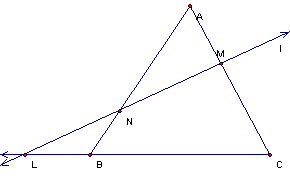
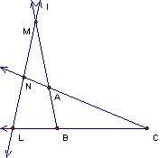
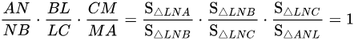
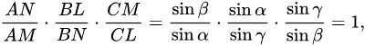
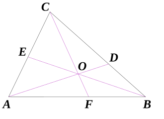
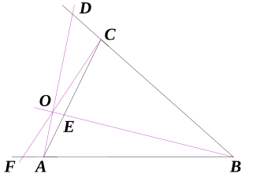
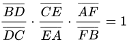
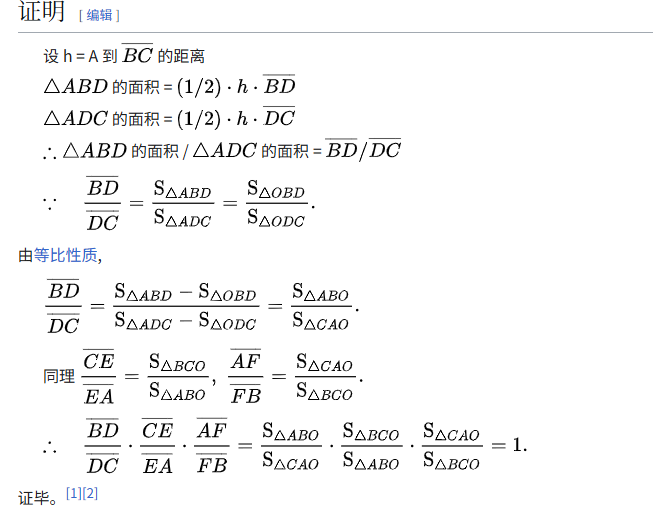
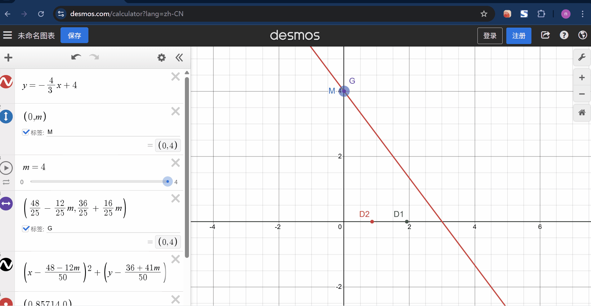

## wch

### 基本个资
- 来访者姓名：WCH
- 性别：男
- 年龄：12
- 来访动机：几何压轴数学
- 教育背景：初三
- 初步学习状态：大体全对，填选出现误填，压轴出现计算失误

### 日期与过程

#### 2025-05-01
目标：二模压轴，订正，小题

过程：
- 作业:大题、订正

### 规划与小结 

#### 目标及计划
刷二模，做大题及订正，刷剩小题。

#### 反思

我的精力、时间是有限的，来访潦草、论述糟糕的书写提高了我对他订正、状态判断的成本。因此，尽管来访表现出巨大的抗拒并在订正过程中出现放空、急躁、碎碎念、痛苦的表现，我依然选择采取方案二。暂时并未掌握这意味着什么，但我将继续进行方案二治疗。

事实上，通过与`在职九个半的地理老师`及`Vegas`的交流，老师通常会直接对不服管教的学生放养、与家长沟通。同时他提出一分钱一分货的观点。

由于ptj价格相较于学校老师显然是低的，因此的确不应该拿主流领域中的最高标准来要求老师，有过思考的抉择已经是负责任的表现。

#### 方案

- 方案一：刷题讲思路

- 方案二：订正以保证理解

- 方案三：放羊并做任何学生感兴趣的事情

- 方案四：直接抄答案，分析keypoints并记录教案

### 结论与建议
- 是否结束家教:

--
- 转介建议:

建议找专业辅导机构，咨询好学校同学家长，以更高效率学习数学。

## 备课

### 题解

_2023徐汇二模-24-2-2@矩形,直角@一线三等角，一元二次,一个合法根@相切圆_

### 教案

## *梅氏定理@wikipedia

梅涅劳斯定理（Menelaus' theorem）最早出现在古希腊数学家梅涅劳斯的著作《球面三角学》，`定理的平面版本`被用作证明`该定理的球形版本`的引理。对于初中数学来说，属于平行线段成比例问题的高层次抽象模型，模型范围覆盖`三角形被直线所截`类问题。与`塞瓦定理的等式`在条件上有所不同，二者互为对偶定理。

### 正定理

它指出：如果一直线与△ABC的边BC、CA、AB或其延长线分别交于L、M、N，则有：  

_正定理_ ∎

_case-1:直线LNM穿过三角形ABC_
_case-2:直线LNM在三角形ABC外面(M与N位置可能有错)_

### 逆定理(也成立，可用于证明三点共线)

若有三点L、M、N分别在△ABC的边BC、CA、AB或其延长线上（有一点或三点在延长线上），且满足：

_逆定理_

则L、M、N三点共线。 ∎

### 证明

#### @面积法SHM

_case-1:直线LNM穿过三角形ABC_

如情况一，连接AL、CN有：

_SHM_ ∎

#### @正弦定理

_case-1:直线LNM穿过三角形ABC_

如情况一，设∠ANM=α，∠AMN=β，∠MLC=γ，则在△AMN中由正弦定理，有：

_正弦定理_ ∎

## *塞瓦定理@wikipedia

塞瓦定理（Ceva's theorem）最先由意大利数学家乔瓦尼·塞瓦（Giovanni Ceva，1647年12月7日—1734年6月15日）证明，另外，他重新发现了梅氏定理。

塞瓦线、塞瓦线段，指各顶点与其对边或对边延长线上的一点连接而成的线段。

### 正定理

_case1-三条线段的交点O 位于三角形ABC的内部_
_case2-三条线段的交点O 位于三角形ABC的外部_

塞瓦定理指出：如果△ABC的塞瓦先线段AD、BE、CF交于一点O，则：

_塞瓦定理_ ∎

### 逆定理（同样成立，可用于证明三线共点）

它的逆定理同样成立：若D、E、F分别在△ABC或其延长线上（都在边上或有两点在延长线上），且满足：

_塞瓦逆定理_ 

则直线AD、BE、CF共点或彼此平行（于无限远处共点）。当AD、BE、CF中任两条直线交于一点，则三直线共点；当AD、BE、CF中任两条直线平行，则三直线彼此平行。∎

### 证明

_case1-三条线段的交点O 位于三角形ABC的内部_

_证明_ ∎

### 对偶定理的讨论

塞瓦定理讲的是三条线交于一点，梅涅劳斯定理讲的是三点共线。而这两种情况在几何学里是经典的对偶关系：
- 一点可以看作是多条线的“汇聚”（共点）。
- 一条线可以看作是多点的“轨迹”（共线）。

它们“交换了”点和线的角色。

## *[Desmos图形计算器](https://www.desmos.com/calculator?lang=zh-CN)

_使用范例_
