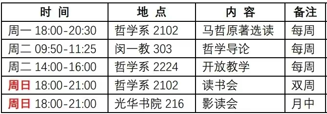

---
# the default layout is 'page'
icon: fas fa-info-circle
order: 4
---

#1b1b1e 向你问好:)

<!-- chalkboard@pin -->
## 📌 Pinboard 

_timetable_

## livestreaming

直播，默认自己看自己，欢迎来玩。

## Badge

badge暂时是基于sheield.io的静态版本，超链接通过md语法中对图片超链接实现。

## <i class="fa-solid fa-toggle-off">  </i>Reference
0. [How-to-post](http://localhost:4000/posts/write-a-new-post/)
1. [Chronic.local](http://localhost:4000/)(限本地开发)
2. [Chronic](https://nsgih.github.io/)  
3. [jekyll-chirpy-theme](https://github.com/cotes2020/jekyll-theme-chirpy)
4. [chirpy-demo](https://chirpy.cotes.page/)
5. [jekyll-component](https://github.com/jekyll/jekyll-compose)

## <i class="fa-solid fa-toggle-on">  </i>Wormhole
- [oassihu@记者](https://matters.town/@oasishu)
- [Wormhole](https://wormhole.app/)
- [977](https://rin977.com/)
- [lainbo@区块链博客](https://lainbo.dev/)
- [antfu@开源玩家](https://antfu.me/)
- [@博客看板娘](https://gardencavy.site/course/blog/blog03/)
- [医学统计学@王超辰](https://wangcc.me/LSHTMlearningnote/)
- [zy](https://yangzhang.site/)

## <i class="fa-solid fa-map-pin"></i>  伙伴

### 衣

酒红运动短t @BJHG @135cny @贴身 @180/92A @74.3%棉25.7聚酯纤维 @2025-05-23

### 工具

iphone12 @jd二手 @2298cny

tb后盖 @41cny

airpods4-主动降噪 @环球港 @1399cny @2024-11-09

ipad-mini6 @转转二手95新 @2328cny

image-Preview@ `1200 x 630`

